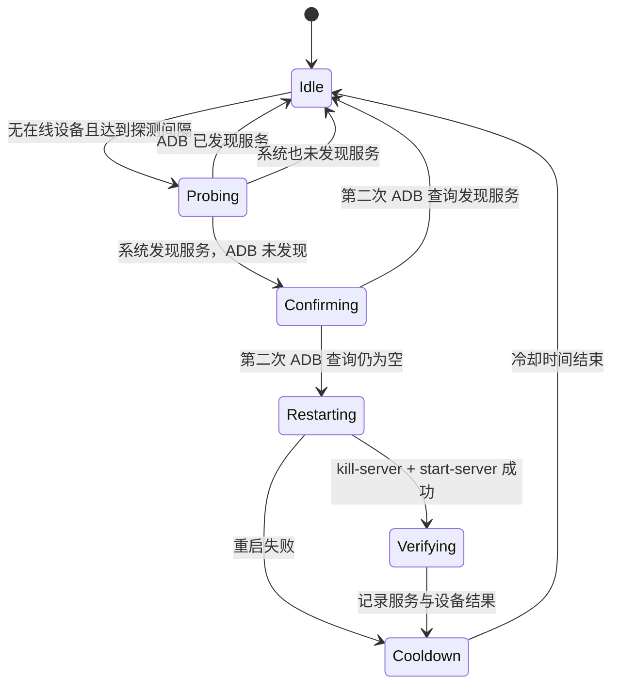

# ADB mDNS 异常自动恢复技术设计

- 状态：Draft
- 日期：2026-08-14
- 适用项目：AdbPilot
- 关联故障记录：[Android 无线调试一直显示“正在配对设备”](../../docs/troubleshooting/android-wireless-debugging-pairing-stuck.md)

## 1. 背景

Android 11 及以上版本的无线调试依赖 mDNS 发布和发现 `_adb-tls-pairing._tcp`、`_adb-tls-connect._tcp` 服务。电脑离开局域网并重新接入后，可能出现以下现象：

- 手机和电脑网络互通；
- 手机配对 TCP 端口可以连接；
- 操作系统 Bonjour 能发现手机发布的 ADB 服务；
- `adb mdns services` 返回空列表；
- Android Studio 扫码后长时间显示“正在配对设备”。

本次实际排查确认，重启 ADB Server 后 mDNS 服务立即恢复可见，说明 ADB Server 的发现状态可能在网络切换后未正确刷新。同时还观察到二维码服务名出现 `(2)` 后缀，说明手机端存在重复或未释放的配对实例。

这两个问题属于不同故障层：

1. **ADB mDNS 发现卡死**：电脑端可通过自动重启 ADB Server 恢复。
2. **二维码服务实例冲突**：电脑端重启 ADB 只能恢复“看见服务”，不能保证 Android Studio 完成配对；通常需要重开手机无线调试、生成新二维码或改用配对码。

因此，本设计不采用“设备列表为空就重启”的粗略策略，而是以系统 mDNS 与 ADB mDNS 的可见性差异作为自动恢复证据。

## 2. 目标

- 自动识别“系统能发现 ADB mDNS 服务，但 ADB Server 发现不到”的确定性异常。
- 在没有在线设备时，自动执行一次 `adb kill-server` 和 `adb start-server`。
- 重启后重新检查 mDNS 服务和设备列表，并向用户展示恢复结果。
- 使用检测间隔、二次确认和冷却时间避免误判与循环重启。
- 保持现有 `PlatformAdapter → AdbClient → GUI` 分层，不在 GUI 中直接拼接系统命令。
- 不记录二维码密码、六位配对码、设备 GUID 或完整序列号。

## 3. 非目标

- 不自动读取或提交 Android Studio 二维码密钥。
- 不代替 Android Studio 完成二维码认证流程。
- 不在已有在线设备时自动重启 ADB Server，以免打断 USB 或无线调试会话。
- 不因为手机 IP 或端口变化而直接判定 ADB 异常；无线调试端口变化属于正常行为。
- 第一阶段不解析 Android Studio 私有日志作为触发条件，避免绑定 IDE 版本和日志格式。
- 第一阶段不承诺所有平台都具备系统级 mDNS 旁路探测能力。

## 4. 项目现状与接入点

### 4.1 `PlatformAdapter`

当前职责是查找不同平台上的 ADB 可执行文件。新增系统 mDNS 探测仍属于平台能力，适合放在 `adbpilot/platform_adapter.py`：

```python
def discover_system_adb_mdns_services(
    self,
    *,
    timeout: float = 1.2,
) -> tuple[SystemMdnsService, ...]:
    ...
```

第一阶段实现策略：

- macOS：调用系统自带的 `dns-sd`，并行监听 `_adb-tls-pairing._tcp` 和 `_adb-tls-connect._tcp`。
- Windows/Linux：只有系统存在兼容的 `dns-sd` 命令时启用；否则返回“不支持旁路探测”，不自动重启。
- 所有监听进程都必须设置短超时，并在超时后 `terminate`，必要时 `kill`，避免遗留后台进程。

### 4.2 `AdbClient`

`AdbClient` 已统一封装 ADB 命令，并已有 `restart_server()`。新增 ADB mDNS 查询和恢复决策：

```python
def mdns_services(self) -> tuple[AdbMdnsService, ...]:
    ...

def recover_stale_mdns(self) -> MdnsRecoveryResult:
    ...
```

`AdbClient` 负责比较两类证据并执行恢复；调用方不需要了解 `dns-sd` 输出格式。

### 4.3 `AdbPilotGui`

GUI 已通过后台线程每 3 秒调用 `devices()`，不会阻塞 Tk 主线程。自动恢复应接入现有设备监听 worker，但使用独立的 15 秒探测间隔：

- 在线设备为空时才允许进入自动恢复检测；
- mDNS 探测不在 Tk 主线程执行；
- 恢复完成后通过现有 `result_queue` 回到主线程更新界面；
- 输出区显示是否重启、重启后的发现结果及下一步建议。

CLI 和 AI CLI 第一阶段保持不变。后续可以复用 `AdbClient` 能力增加显式诊断命令，而不复制判断逻辑。

## 5. 故障判定模型

### 5.1 必要条件

只有以下条件全部成立，才允许自动重启 ADB Server：

1. 自动恢复功能已启用。
2. 当前没有 `device`、`offline`、`unauthorized` 等在线 ADB 设备记录。
3. 距离上一次探测不少于 15 秒。
4. 距离上一次自动重启不少于 60 秒。
5. `adb mdns check` 表明当前 ADB 支持 mDNS。
6. 第一次 `adb mdns services` 没有发现 ADB TLS 服务。
7. 系统 mDNS 旁路探测发现 `_adb-tls-pairing._tcp` 或 `_adb-tls-connect._tcp`。
8. 第二次 `adb mdns services` 仍为空。

第 7 条证明手机正在发布无线调试服务，第 6、8 条证明不是单次采样抖动。若没有系统旁路证据，设备为空和 ADB mDNS 为空都属于正常状态，不得自动重启。

### 5.2 不触发场景

- 没有手机处于无线调试或配对状态。
- 系统 mDNS 与 ADB mDNS 都没有发现服务。
- ADB 已发现配对或连接服务，只是 Android Studio 尚未完成认证。
- 任意 ADB 设备在线，包括 USB 设备。
- 系统没有可用的 mDNS 旁路探测命令。
- 当前处于自动重启冷却时间。

### 5.3 二维码名称冲突

服务名带 `(2)`、`(3)` 等后缀只能作为“疑似重复实例”提示，不能单独触发 ADB 重启，原因是 AdbPilot 不掌握 Android Studio 当前二维码中期望的服务名。

如果重启后 ADB 已能发现带数字后缀的配对服务，但设备仍未上线，GUI 应提示：

> 已恢复 ADB 服务发现，但检测到疑似重复配对实例。请关闭并重新打开手机无线调试，重新生成二维码，或改用配对码。

## 6. 状态机



状态不需要持久化。应用重启后从 `Idle` 开始，但 ADB Server 重启时间应在当前 GUI 进程内记录，避免同一运行周期重复操作。

## 7. 数据结构

建议增加不可变结果类型，避免用布尔值丢失诊断信息：

```python
@dataclass(frozen=True)
class MdnsRecoveryResult:
    status: str
    restarted: bool = False
    adb_services_before: tuple[AdbMdnsService, ...] = ()
    system_services: tuple[SystemMdnsService, ...] = ()
    adb_services_after: tuple[AdbMdnsService, ...] = ()
    devices_after: tuple[Device, ...] = ()
    message: str = ""
```

`status` 使用受控值：

| 状态 | 含义 |
| --- | --- |
| `not_needed` | ADB 已能发现服务 |
| `no_system_evidence` | 系统也未发现服务，不满足恢复条件 |
| `unsupported` | 当前系统不能执行旁路 mDNS 探测 |
| `recovered` | 已重启，服务或设备恢复可见 |
| `restarted_unverified` | 已重启，但短时间内尚未验证恢复 |
| `restart_failed` | ADB Server 重启失败 |
| `suspected_name_conflict` | ADB 已发现疑似重复服务，需用户处理手机侧实例 |

服务对象只保留恢复所需字段：服务类型、脱敏后的实例类型信息、IP 和端口。日志默认不输出完整实例名。

## 8. 恢复流程

伪代码如下：

```text
poll devices
if any device exists:
    skip automatic recovery

if probe interval or restart cooldown is not satisfied:
    skip

if adb mdns is unsupported:
    return unsupported

adb_before = adb mdns services
if adb_before is not empty:
    return not_needed

system_services = system mdns browse with timeout
if system_services is empty:
    return no_system_evidence

adb_confirm = adb mdns services
if adb_confirm is not empty:
    return not_needed

adb kill-server
adb start-server
wait a short bounded stabilization interval

adb_after = adb mdns services
devices_after = adb devices -l
enter cooldown regardless of verification result
return structured result
```

`kill-server` 允许非零退出，因为 Server 可能本来就未运行；`start-server` 必须成功，否则返回 `restart_failed`。

## 9. 配置与默认值

沿用现有 `~/.adbpilot/gui.json`，建议配置结构：

```json
{
  "wireless_recovery": {
    "enabled": true,
    "probe_interval_seconds": 15,
    "restart_cooldown_seconds": 60,
    "system_browse_timeout_seconds": 1.2,
    "confirm_delay_seconds": 0.3
  }
}
```

约束：

- 缺少配置时默认启用，但只在系统旁路探测可用时生效。
- 非法值回退到默认值。
- 最小探测间隔建议限制为 5 秒，最小重启冷却限制为 30 秒。
- 第一阶段可以不提供 GUI 配置入口，只读取默认值；后续再增加“自动恢复无线调试”开关。

## 10. 并发与安全

- mDNS 探测和 ADB 重启复用设备监听后台线程，禁止在 Tk 主线程执行。
- 使用现有 `device_poll_running` 防止并发轮询，再增加 `mdns_recovery_running` 防止手动刷新与自动恢复重叠。
- 自动重启前再次检查设备列表，降低探测期间设备刚上线造成的竞态。
- 用户点击“重启服务”时，自动恢复进入冷却，避免紧接着再次重启。
- 应用退出时终止仍在运行的 `dns-sd` 子进程。
- 无论恢复成功与否，一次重启后都进入冷却；禁止无界重试。

## 11. 可观测性

建议 GUI 输出以下阶段日志：

```text
检测到系统可见但 ADB 不可见的无线调试服务，正在二次确认…
ADB mDNS 状态持续异常，正在自动重启 ADB Server…
ADB Server 已自动重启，已恢复无线调试服务发现。
ADB Server 已重启，但设备尚未上线；请保持无线调试开启。
已恢复服务发现，但存在疑似重复配对实例，请重新生成二维码或改用配对码。
```

日志不得包含：

- 二维码密码或六位配对码；
- 设备 GUID 和完整序列号；
- 完整 Wi-Fi 名称；
- Android Studio 二维码原文。

## 12. 测试方案

### 12.1 单元测试

`tests/test_platform_adapter.py`：

- 解析 `dns-sd` 有服务、无服务和异常输出。
- 命令缺失时返回 unsupported。
- 超时后终止子进程。
- 两类 ADB TLS 服务并行探测并正确合并结果。

`tests/test_client.py`：

- 解析 `adb mdns services` 输出。
- ADB 已有服务时不调用系统探测、不重启。
- 系统也无服务时不重启。
- 系统有服务、ADB 两次为空时只重启一次。
- 二次确认时 ADB 恢复可见，不重启。
- `kill-server` 失败不阻止 `start-server`，`start-server` 失败返回结构化错误。

`tests/test_gui_helpers.py`：

- 配置默认值和非法值回退。
- 探测间隔与重启冷却判断。
- 有在线设备时不进入自动恢复。
- 恢复结果映射为正确且脱敏的提示文本。

### 12.2 手动集成验证

1. 正常无设备：运行 GUI 2 分钟，确认不会重启 ADB。
2. USB 设备在线：模拟系统 mDNS 服务，确认不会自动重启。
3. 手机打开配对页面且 ADB 正常：确认不重启。
4. 手机打开配对页面，构造 ADB mDNS 不可见：确认自动重启一次并恢复发现。
5. 保持异常超过 60 秒：确认冷却期内不重复重启。
6. 制造带 `(2)` 后缀的服务：确认仅提示手机侧处理，不循环重启。
7. 关闭 `dns-sd` 或在不支持的平台运行：确认功能安全降级，手动“重启服务”仍可用。

## 13. 方案边界与可行性结论

自动执行 `adb kill-server`、`adb start-server` 在本项目中可行，已有 `AdbClient.restart_server()` 可复用，GUI 也已有异步设备监听线程。新增工作的重点不在执行命令，而在建立足够可靠的触发证据。

按本设计实现后，可以自动处理本次故障中的 **ADB mDNS 发现卡死**，避免 Android Studio 长期停留在完全发现不到服务的状态；但不能自动清理手机端重复二维码实例，也不能访问 Android Studio 的配对密钥。出现服务名冲突时，产品应停止自动重启并给出明确的手机侧恢复建议。

## 14. 实施顺序

1. 增加 mDNS 输出解析函数和单元测试。
2. 在 `PlatformAdapter` 实现带超时的系统 mDNS 旁路探测。
3. 在 `AdbClient` 实现结构化差异判断和一次性恢复。
4. 在 GUI 设备监听中加入间隔、二次确认、无设备保护和冷却。
5. 增加脱敏日志与疑似名称冲突提示。
6. 运行完整单元测试和 macOS 真机集成验证。
7. 后续按需要为 CLI/AI CLI 增加显式无线诊断操作。
