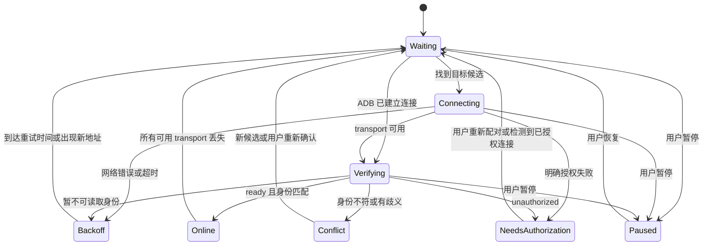

# 无线设备自动重连技术方案

状态：设计稿，尚未实现。日期：2026-09-14。

需求见 [PRD](prd.md)。代码基线：`82f6b06`，分支 `feat/device_list`。本文的新模块、接口与参数均为拟议设计，不代表当前已存在。

## 1. 文档归属与现状

AdbPilot 是一个统一应用：CLI 和 GUI 共享 `adbpilot` 包，Windows/macOS 打包目录是同一产品的发布入口。因此本需求文档放在根目录 `doc/wireless-auto-reconnect/`；现有 `docs/superpowers/` 和根目录规划文件保持原位。

| 现有代码 | 当前行为 | 本需求需要补充 |
| --- | --- | --- |
| [client.py](../../adbpilot/client.py) 的 `devices()`、`_deduplicate_devices()` | 在线连接基于 `ro.serialno` 合并；少于两个 ready 设备时不读取身份 | 分离原始传输列表和逻辑设备列表，单台设备也能建立历史身份 |
| `connect()`、`mdns_services()` | 调用 ADB，返回文本 | 后台短超时、结构化结果、连接后验证 |
| `wait_for_mdns_connect_service()` | 按 host 查找，可回退到其他服务 | 不用于身份敏感的重连，新增严格候选筛选 |
| `pair_by_qr()` | 会话内发现配对／连接服务并连接 | 与自动重连分开标记来源，不能以任意新连接判定扫码成功 |
| [gui.py](../../adbpilot/gui.py) 的 `_poll_devices()`、`_read_devices()` | 后台线程轮询，使用 `adb_service_lock` 协调 server 重启 | 独立重连调度、取消、会话代次 |
| `_run_async()`、`_process_results()` | 队列回到 Tk 主线程处理结果 | 增加类型化重连事件，避免覆盖 QR 状态 |
| `device_rows`、`locked_serial_var` | 使用 ADB transport serial 作为选择／锁定依据 | 引入稳定的逻辑设备 ID 和当前 transport 映射 |
| `gui_config_path()` | UI 配置存放在 `~/.adbpilot/gui.json` | 单独存储设备历史，避免与窗口配置并发覆盖 |

## 2. 协议事实与设计选择

ADB 的无线连接服务与配对服务是不同服务，端口不可互换。原生 ADB 会尝试自动连接已配对设备；配对前连接服务也可能已存在，因此不能仅依赖“新增服务”判断连接结果。服务实例通常包含设备标识及后缀，但不能假定所有厂商和版本具有永久不变的名称。[AOSP 无线 ADB 架构](https://android.googlesource.com/platform/packages/modules/adb/+/HEAD/docs/dev/adb_wifi.md)

采用“原生自动连接优先 + mDNS 完整快照 + 已记住身份筛选 + 连接后校验”。旧地址只是有时效的候选，不是身份；硬件序列号是业务关联信息，不是密码学认证凭据，实际授权仍由 ADB 完成。

不解析或修改 ADB 的私有配对数据库，不复制私钥，不全网扫描。ADB 环境变量和发现能力随版本变化，先检测可用命令；不自动改变共享 server 的发现设置。[ADB 命令参考](https://android.googlesource.com/platform/packages/modules/adb/+/refs/heads/main/docs/user/adb.1.md)

最新官方指南还包含更新版本的发现接口，首期使用当前项目已有的 `mdns services` 能力；不将新接口作为所有用户环境的必备条件。网络失败不能单凭一条错误文本归因为授权撤销。[Android ADB 指南](https://developer.android.com/tools/adb)

## 3. 数据模型与持久化

新增 `adbpilot/device_history.py`，定义历史模型与存储；新增 `adbpilot/reconnect.py`，定义状态、事件和调度。保持现有 CLI／AI CLI 的返回结构与手动连接行为。

三个概念必须分开：

- `device_id`：应用生成的 UUID，历史记录、UI 选择与锁定使用它。
- `hardware_serial`：通过已授权 transport 读取的 `ro.serialno`，用于身份匹配；为空、unknown 或冲突时不自动绑定。
- `transport_serial`：传给 `adb -s` 的当前连接目标，可能是 USB serial、IP:port 或 mDNS 别名；只代表这次传输。

历史文件为 `~/.adbpilot/devices.json`，Windows 对应 `%USERPROFILE%\.adbpilot\devices.json`。示例字段：

```json
{
  "schema_version": 1,
  "devices": [
    {
      "device_id": "530a17ad-6a16-4b58-89ef-4d8e2928e416",
      "hardware_serial": "example-serial",
      "display_name": "测试手机",
      "model": "example-model",
      "wireless_mode": "tls",
      "auto_reconnect": true,
      "paused_by_user": false,
      "last_endpoint": {"host": "192.168.1.80", "port": 39621},
      "verified_service_names": ["adb-example-serial-abc123"],
      "last_verified_at": "2026-09-14T12:20:04Z"
    }
  ]
}
```

模型、名称仅用于展示和辅助检查，不能作为合并依据。已验证服务名也只是候选线索，连接后仍需读取身份。内存中另存 `current_transports`、`active_transport`、`generation`、`attempt_id`、`next_retry_at`，不把进程内退避时钟写入磁盘。

持久化规则：

- 同目录临时文件写入、flush 后使用 `os.replace` 原子替换；仅在身份、地址、开关等发生变化时写入。
- GUI 主线程为唯一写入者；worker 通过队列返回不可变结果，禁止直接修改历史文件。
- 多个 AdbPilot 进程通过历史文件的独占锁选出写入者；其他实例只读，禁用主动重连并展示原因，仍可使用手动 ADB 操作。
- 文件缺失视为空历史。文件损坏时保留原件、停止覆盖并提示修复；未知 schema 以只读模式加载，避免降级破坏数据。
- 不保存配对密码或密钥。凭据继续由 ADB 管理；存储失败不能把已建立的连接误报为失败。

## 4. 身份采集与候选筛选

### 首次登记

手动连接或配对成功后必须观察到 `device` 状态，再显式指定 transport 执行 `shell getprop ro.serialno`。单台设备也执行。记录本次连接上下文，并在地址或完整 mDNS transport 别名能精确对应时保存服务名；不能把列表中的第一个服务名写给该设备。

其他客户端建立的设备连接可用于在线展示和匹配现有历史；只有用户启用自动重连才登记新的历史。保存“曾经配对成功”不是证明当前授权有效。

### 候选优先级

1. 已在线 transport 的实测身份精确匹配：直接采用，避免重复 `adb connect`。
2. 本轮 mDNS 完整快照中，完整服务实例名命中该设备已验证记录。
3. 兼容适配器识别到明确的 `adb-<已知硬件序列号>-<后缀>` 边界格式，生成候选；禁止模糊包含匹配，并防止两个历史序列号同时命中。该路径必须通过连接后校验，不把名称本身当作可信身份。
4. 无可用发现结果时，有限尝试最近成功地址。该设备已有新地址通过验证后，立即淘汰旧地址候选。

未知格式的服务只记录诊断，交给原生 ADB 自动连接或用户手动确认，不能连接所有发现到的手机再逐个猜测。如果服务名和 IP 都变化且无法匹配，自动恢复可能不可用；此时不牺牲身份准确性来保证成功率。

只使用 `_adb-tls-connect._tcp` 的解析结果；复用当前服务类型正规化逻辑，兼容有无前导下划线和末尾点。地址结构化为 host/port，校验端口范围；支持解析方括号 IPv6，但不承诺旧版 ADB 能发现 IPv6。不要用 `split(':')` 解析地址，也不拼接 shell 字符串执行命令。

## 5. 重连状态与流程



图示主流程；所有活动状态均可暂停或被忘记。暂停是独立策略位，不等价于离线：外部 ADB 建立连接后，仍显示在线，但本应用不发起连接。进入 `NeedsAuthorization` 后停止主动高频连接，继续被动观察在线列表。

每轮处理顺序：

1. 合并启动、轮询、手动刷新等触发，检查启用与暂停状态，生成 attempt ID 和 generation。
2. 读取原始 `adb devices -l`；对新出现或重建的 ready transport 读取身份，先处理原生 ADB 已完成的恢复。
3. 若有待恢复设备且发现到期，读取一份 mDNS 快照供所有设备共享。查询为空不清除历史，也不否定已在线设备。
4. 严格筛选候选，取得该 endpoint 的互斥执行权，执行短超时 `adb connect`。返回码和文本只作诊断，不能独自决定成功。
5. 在验证预算内重新查询设备列表并读取身份。只有 ready 且身份匹配才能提交成功结果。
6. 主线程确认 generation 仍有效，再更新映射、最近地址、选择与锁定，并写历史。否则只丢弃过期结果。
7. 失败按分类进入退避、授权处理或身份冲突；记录本轮结束，释放 endpoint 和设备执行权。

对旧地址连接到了不同手机的情况，不更新原记录，不发送安装、文件、Shell 业务命令。连接后的只读身份查询允许执行。共享 server 下不自动断开陌生 transport，避免影响其他客户端；该设备也不得因本次候选连接而自动成为当前业务目标。

## 6. 调度、超时与取消

以下是首期默认值，需通过真机测试调整：

| 项目 | 初始策略 |
| --- | --- |
| 设备观察 | 复用现有轮询；合并同时发生的手动刷新与自动刷新 |
| mDNS 查询 | 有待恢复设备时最多每 5 秒一次；长期无变化后降至 30 秒 |
| `connect` 超时 | 单候选 8 秒；后台调用显式传入，不改变手动连接的原超时 |
| 只读查询超时 | 单命令 3 秒；一次身份验证总预算 6 秒 |
| 重试退避 | 每台设备 2、5、10、30、60 秒，之后维持 60 秒，附加不超过 20% 抖动 |
| 新地址 | 重置该设备退避，立即入队；同一 endpoint 失败保持冷却 |
| 并发 | 全局最多 2 个恢复 worker；每设备、每 endpoint 最多 1 个任务 |
| 公平性 | 每设备每轮最多尝试 1 个候选，失败轮转；不允许单设备占满队列 |
| 身份缓存 | 仅缓存仍连续存在的 transport；消失、状态变化或 server 重启后失效 |

调度使用单调时钟，worker 不长时间 `sleep` 占用队列。首期通过周期轮询覆盖网络恢复，不依赖新增跨平台网络监听库；因休眠跨过执行时间后只补一轮，不补发全部错过任务。

扩展 `AdbClient` 的只读／连接调用以接收显式超时。取消事件在每步命令前后检查；正在运行的 `subprocess.run` 最长等当前命令超时，暂停状态立即更新，但不承诺撤销已交给 ADB server 的连接请求。

暂停、忘记、关闭 GUI、切换 ADB 路径和重启 server 都递增 generation。旧结果必须在 GUI 提交前被丢弃，不能重新创建忘记的记录。

共享 ADB 命令经现有 `adb_service_lock` 或其统一封装保护 kill/start 间隙；仅包围实际命令，不持锁覆盖退避与用户等待。用户请求重启时先暂停新调度，再等待有界在途命令结束，重启后作废缓存并重新发现。首期不为重连失败自动执行 `kill-server`。

## 7. UI 与现有功能接入

- 保留 `Device` 作为 transport 级返回，新增原始列表读取接口供重连管理器使用；现有 `devices()` 的 CLI 契约保留。
- GUI 使用逻辑设备快照展示；同身份多个 transport 合并计数，未确认身份的 transport 单独展示且标注未确认，不擅自合并。
- 有活动 transport 时优先保持它，避免每次轮询在 IP 与 mDNS 间切换；失效后选择同身份其他 ready transport。USB 尚可用时不强制为了计数再建立 Wi-Fi。
- 选择与锁定增加 `selected_device_id`、`locked_device_id`，`_selected_serial()` 通过映射获取当前 transport。无有效映射时明确报错，不能返回空值让 ADB 选择另一台唯一设备。
- 后台重连不能把未选中的设备设为当前操作目标；有选择或锁定时，只更新同逻辑设备的 transport。
- 业务任务入队时固定目标与 generation，不在 worker 中读取 Tk 变量；执行前检查映射仍有效。重连不重放未完成的业务操作。
- 增加历史设备视图、每设备自动重连开关、立即重连、暂停／恢复、忘记记录及日志保存。忘记后，同一已在线 transport 不在下一次轮询自动重新登记。
- QR 配对会话与重连使用不同事件来源及会话 ID。QR 活动期间可继续被动观察，暂停应用主动重连；结束后恢复调度。已有设备上线不能作为扫码成功证据。
- 调整 QR 完成判据时，使用实际配对会话结果和可关联的目标验证；不能把“任何新增 connect 地址”认作本次扫码成功。这是本需求集成必须处理的既有边界，不承诺本轮重新设计整个多设备扫码流程。

## 8. 日志与故障分类

事件建议字段：`timestamp`、`source`、`attempt_id`、`device_id`、`generation`、`stage`、`result`、`duration_ms`、`retry_after_ms` 和 `error_code`。日志 formatter 输出中文，UI 在主线程追加。

故障类别：`discovery_unavailable`、`endpoint_timeout`、`transport_offline`、`authorization_required`、`identity_unavailable`、`identity_mismatch`、`cancelled`、`history_write_failed`。未知非零退出或模糊文本归为连接错误，不自动归类为需重新配对。

每轮必须有 start 和 finish，finish 区分 success、failure、cancelled。稳定等待状态不按轮询刷屏；重复错误累计次数，最长每 60 秒汇总一次。保存最近 2000 条诊断事件，超出滚动淘汰；用户导出该缓冲区为 UTF-8 文本，默认遮蔽完整地址和硬件序列号。

只记录命令类型、耗时和必要错误摘要，不记录配对码、二维码密码和完整敏感命令参数。界面按用户需要显示本机真实地址，导出使用单独的脱敏 formatter。

## 9. 验证与交付

自动化测试使用 fake clock、模拟 ADB 输出和临时目录，避免真实睡眠或依赖局域网。重点覆盖：

| 测试组 | 关键用例 | 对应 PRD |
| --- | --- | --- |
| 身份与发现 | 原生已连接、IP/端口变化、历史服务已存在、后缀变化、未知格式、IPv6 解析 | A1、A5 |
| 去重与目标 | IP/mDNS/USB 合并、同型号不同序列号、旧 IP 被占、冲突身份 | A2、A3、A4 |
| 调度 | 超时、退避、限流、公平性、休眠恢复、反复刷新合并 | A6 |
| 结果验证 | connect 返回成功但 offline、授权错误、空身份、模糊错误分类 | A7 |
| 取消与会话 | 连接中暂停／忘记、路径切换、重启、关闭后的晚到回调 | A8 |
| GUI 目标 | 锁定跟随身份、另一台上线不替换目标、业务任务不重放 | A9 |
| QR 集成 | 历史设备上线不改变 QR 结果、配对与重连事件分离 | A10 |
| 共享 server | 暂停后外部连接仍在线、没有循环断开 | A11 |
| 存储与诊断 | 原子写入失败、损坏文件、未知版本、第二实例只读、日志限量与脱敏 | A12 |

真机验收按 PRD 的 A1 至 A12 执行，记录手机 Android 版本、ADB 版本、网络条件和耗时。Windows 至少两台不同硬件序列号的手机；模拟输出不能代替 mDNS、DHCP 换地址、休眠或手机授权撤销的验证。完成首期验收后再声明其他平台支持情况。

分阶段实现：先模型与存储，再发现／验证状态机，随后 GUI 与 QR 集成，最后真机回归。每阶段运行相关测试，整体验收前运行 `python -m unittest discover -s tests -v`。

关闭自动重连即回到手动连接模式，保留历史文件；回退到旧版本应忽略新增文件。不开启自动重连不会改变共享 ADB server 的原生行为。

## 10. 尚需实测的限制

- 厂商服务名与硬件属性差异：不支持的格式走原生自动连接或手动确认，不承诺所有机型均可自动匹配。
- mDNS 被网络阻断且旧 IP 已失效：没有可靠地址来源，需手动输入新地址；固定 DHCP 可减轻 IP 变化，但无法解决动态端口。
- `ro.serialno` 并非所有 ROM 都可读或唯一；无法可靠确认时停止自动关联，不引入基于型号、MAC 或 IP 的替代猜测。
- ADB 与其他工具共享连接，应用级暂停无法禁止其他客户端或 server 自动连接。
- 30 秒恢复目标需以新服务持续可见且命令响应正常为前提；大规模设备、不可读身份和网络隔离不计入该目标。
