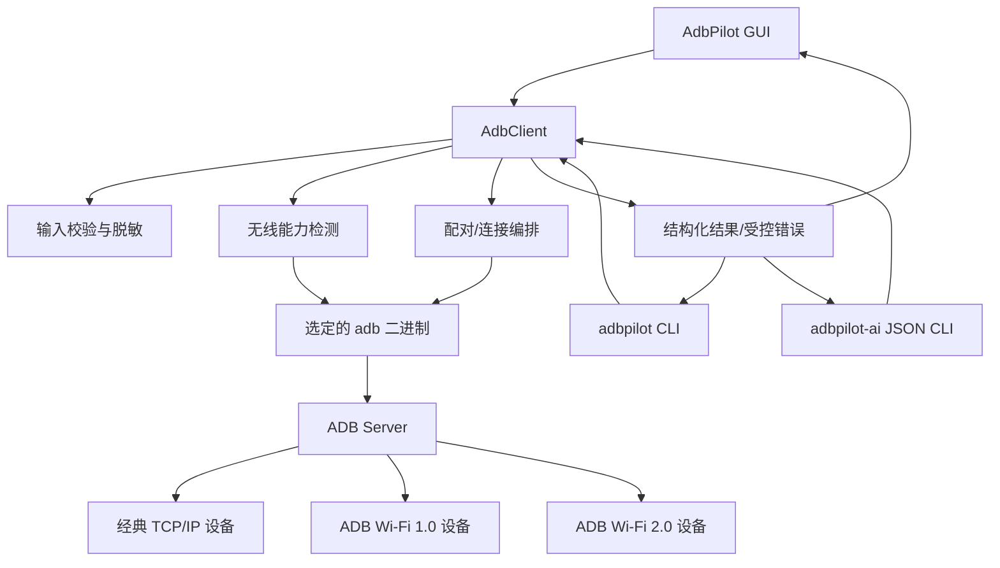
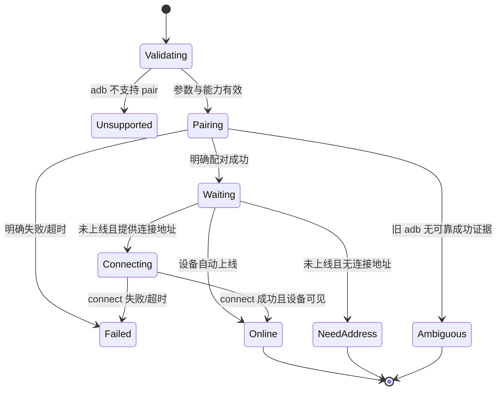

# AdbPilot ADB Wi-Fi 1.0 / 2.0 兼容技术方案

- 状态：Draft
- 日期：2026-08-20
- 目标分支：`codex/feat-adb-wifi-v1-v2-compat`
- 关联 PRD：[AdbPilot ADB Wi-Fi 1.0 / 2.0 兼容 PRD](../product/adb-wifi-v1-v2-compatibility-prd.md)

## 1. 方案摘要

本方案在现有 `PlatformAdapter → AdbClient → GUI/CLI/JSON CLI` 分层上增加无线能力探测、安全配对和配对后连接编排。AdbPilot 不实现 ADB Wi-Fi 协议栈，而是复用用户选择的 Android SDK Platform-Tools：

- 经典 TCP/IP 继续调用 `adb connect` / `adb disconnect`。
- ADB Wi-Fi 1.0 调用 `adb pair`，兼容 Android 11–16。
- ADB Wi-Fi 2.0 由 adb 37+ 与 Android 17+ 协商；AdbPilot 检测主机是否具备兼容条件并提供一致的用户流程。
- 配对码仅以内存字符串存在，通过子进程标准输入发送，不出现在命令参数、结果对象或日志中。

## 2. 设计依据

Android 官方资料给出的关键约束如下：

1. Android 11 及以上支持无线调试；Android 17 与 adb 37.0.0 引入 ADB Wi-Fi 2.0，可信网络上的自动连接体验得到改善。
2. `adb pair HOST[:PORT] [PAIRING_CODE]` 用于安全 TCP/IP 配对；`adb connect HOST[:PORT]` 用于建立 TCP/IP 连接。
3. ADB Wi-Fi 使用 `_adb-tls-pairing._tcp` 和 `_adb-tls-connect._tcp` 服务；`adb mdns check` 与 `adb mdns services` 可用于检查和列出服务。
4. 配对端口与连接端口是不同的临时端口，不能默认复用。
5. 最新 Platform-Tools 原则上向后兼容旧 Android 版本，产品应推荐升级主机工具，而不是捆绑多套协议实现。

参考：

- [Android：通过 Wi-Fi 连接设备](https://developer.android.com/studio/run/device#wireless)
- [Android SDK Platform-Tools 发布说明](https://developer.android.com/tools/releases/platform-tools)
- [AOSP：ADB Wi-Fi 架构](https://android.googlesource.com/platform/packages/modules/adb/+/HEAD/docs/dev/adb_wifi.md)
- [AOSP：ADB 命令手册](https://android.googlesource.com/platform/packages/modules/adb/+/refs/heads/main/docs/user/adb.1.md)

## 3. 现状与问题

### 3.1 当前实现

- `adbpilot/client.py` 已有 `connect()`、`disconnect()`、`devices()`、`version()` 与统一的 `run()`。
- `adbpilot/cli.py` 已暴露 `connect` / `disconnect`。
- `adbpilot/ai_cli.py` 已暴露同名 JSON 操作与 schema。
- `adbpilot/gui.py` 的“无线调试”区域只有一个连接地址输入框；操作通过 `_run_async()` 在后台线程执行。
- 测试以 Python `unittest` 为主，现有客户端测试更偏向纯解析逻辑。

### 3.2 当前缺口

- 没有 `adb pair` 封装，GUI 无法完成 Android 11+ 安全配对。
- 没有区分配对地址和连接地址，容易误用端口。
- 没有稳定的 platform-tools 版本解析或无线能力模型。
- 直接复用现有 `run()` 无法安全地通过标准输入传入配对码。
- 错误只有通用 `AdbCommandError`，界面无法给出针对无线配对的下一步。
- 三个入口缺少统一的结构化配对结果。

## 4. 目标与非目标

### 4.1 技术目标

- 在不新增第三方运行时依赖的前提下实现能力检测、配对、连接和结果验证。
- 所有无线业务逻辑只实现一次，由 GUI、CLI 和 JSON CLI 复用。
- 对旧 adb、Wi-Fi 1.0、Wi-Fi 2.0 和经典 TCP/IP 安全降级。
- 建立配对码不落盘、不入参数、不入日志的可测试保证。
- 所有 GUI 操作异步、有界、可恢复，不阻塞 Tk 主线程。

### 4.2 技术非目标

- 不自行实现 TLS 配对、mDNS responder/browser 或 Wi-Fi 2.0 协议。
- 不在 MVP 使用 `host:track-mdns-services` 等内部/低层 ADB Server 服务。
- 不生成二维码，不解析 Android Studio 私有状态，不操作 ADB 私钥文件。
- 不实现 ADB Server mDNS 自动重启；该能力进入后续独立设计。
- 不自动执行设备侧 `adb tcpip`。

## 5. 总体架构



核心原则：界面层不解析 adb 文本；`AdbClient` 不判断产品展示形式；Platform-Tools 负责协议，AdbPilot 负责流程与安全边界。

## 6. 数据模型

在 `adbpilot/models.py` 增加不可变数据类型：

```python
@dataclass(frozen=True)
class AdbWifiCapabilities:
    adb_path: str
    adb_version: str
    platform_tools_revision: str = ""
    supports_connect: bool = True
    supports_pair: bool = False
    mdns_status: str = "unknown"
    wifi2_host_compatible: bool = False
    warnings: tuple[str, ...] = ()


@dataclass(frozen=True)
class WirelessPairingResult:
    status: str
    paired: bool
    connected: bool
    pairing_address: str
    connection_address: str = ""
    device_serial: str = ""
    next_action: str = ""
    capabilities: AdbWifiCapabilities | None = None
```

`status` 使用受控值：

| 状态 | 含义 |
| --- | --- |
| `paired_and_connected` | 配对成功且设备已上线 |
| `paired_waiting_for_connect` | 配对成功，但需要用户提供连接地址 |
| `paired_connected_explicitly` | 配对成功，并通过显式连接地址上线 |
| `unsupported` | 当前 adb 不支持安全配对 |
| `ambiguous` | 旧 adb 返回结果无法可靠判断，需要用户复核或升级 |

失败类结果原则上使用异常，而不是构造 `paired=False` 的成功返回，确保 CLI 退出码和 JSON `ok` 一致。

## 7. 能力检测设计

### 7.1 新增接口

```python
class AdbClient:
    def wifi_capabilities(self) -> AdbWifiCapabilities:
        ...
```

### 7.2 检测步骤

1. 调用 `adb version`，保存原始版本文本并解析 Platform-Tools revision，例如 `37.0.1`。
2. 调用 `adb help`，检查命令清单中是否存在 `pair`；版本解析失败时，命令存在性可作为降级证据。
3. 若支持 `pair`，调用 `adb mdns check`，结果归一为 `available`、`unavailable` 或 `unknown`。
4. `supports_pair` 的判定：`pair` 命令存在，并且版本不存在明确低于 30.0.0 的冲突。
5. `wifi2_host_compatible` 的判定：Platform-Tools revision 不低于 37.0.0 且 `supports_pair=True`。mDNS 不可用时仍保留手输地址流程，但附加警告。
6. `supports_connect` 只要 adb 基础调用可用即为真；任何配对能力失败不得影响经典连接。

### 7.3 设备侧代际展示

配对前仅能可靠知道主机能力，不能从截图、IP 或服务名断言设备代际。设备上线后可读取 `ro.build.version.sdk`：

- SDK < 30：标记“不支持 Android 11+ 安全无线调试”，但可能支持经典 TCP/IP。
- SDK 30–36：标记“ADB Wi-Fi 1.0 / 兼容模式”。
- SDK >= 37 且主机 adb >= 37：标记“具备 Wi-Fi 2.0 基础条件”。
- 厂商 ROM/硬件可能未实现最新 API，因此不能把 SDK 条件展示为“已确认支持”；最终以实际配对/连接结果为准。

### 7.4 版本解析

新增纯函数：

```python
def parse_platform_tools_revision(output: str) -> tuple[int, int, int] | None:
    ...
```

兼容以下形式：

```text
Android Debug Bridge version 1.0.41
Version 37.0.1-xxxxxxxx
Installed as /path/to/adb
```

禁止用 `1.0.41` 判断 Platform-Tools 版本；它是 ADB 协议/程序版本标识，不等同于 `37.0.1` revision。

## 8. 输入与子进程安全

### 8.1 地址校验

新增：

```python
def normalize_adb_address(value: str, *, require_port: bool = True) -> str:
    ...
```

规则：

- 去除首尾空白。
- 拒绝空字符串、NUL、换行和其他 ASCII 控制字符。
- 接受 `IPv4:port`、`hostname:port`；为未来兼容，解析器可接受标准 `[IPv6]:port`，但 MVP 不承诺 IPv6 真机验收。
- 端口必须为 1–65535 的十进制整数。
- 配对地址必须显式包含端口；经典 `connect` 仍可在兼容层允许 adb 默认端口，但 GUI 首期要求显式端口以减少歧义。

### 8.2 配对码校验

```python
def normalize_pairing_code(value: str) -> str:
    ...
```

- 只接受 6 位 ASCII 数字。
- 不写入配置、结果、命令记录或日志。
- 进入 `AdbClient` 后只在配对调用作用域内存在，调用结束即释放引用；Python 无法保证物理内存立即清零，文档不作该承诺。

### 8.3 安全标准输入调用

扩展 `AdbClient.run()`，或增加私有 `_run_with_input()`：

```python
def _run_with_input(
    self,
    args: Iterable[str],
    *,
    input_text: str,
    timeout: int,
    check: bool = True,
    redact: Iterable[str] = (),
) -> CommandResult:
    ...
```

配对实际执行形式：

```python
result = self._run_with_input(
    ["pair", pairing_address],
    input_text=f"{pairing_code}\n",
    timeout=60,
    check=False,
    redact=(pairing_code,),
)
```

关键约束：

- `pairing_code` 不得加入 `args`。
- `subprocess.run(..., input=input_text, shell=False)`。
- 创建 `CommandResult` 或异常前，对 stdout/stderr 做精确 secret 替换；替换后的文本才能进入错误格式化。
- 调试日志只记录 `[adb, pair, <redacted-address>]`、退出码和受控状态，不记录标准输入。
- 单元测试必须读取 mock 调用参数，证明 code 不在命令数组和异常字符串中。

## 9. 配对与连接编排

### 9.1 接口

```python
class AdbClient:
    def pair(
        self,
        pairing_address: str,
        pairing_code: str,
        *,
        connect_address: str | None = None,
        wait_for_device_seconds: float = 10.0,
    ) -> WirelessPairingResult:
        ...
```

### 9.2 状态机



### 9.3 详细流程

1. 校验配对地址、配对码和可选连接地址。
2. 获取能力；不支持 `pair` 时抛出 `AdbWifiCapabilityError`，附升级建议。
3. 通过 stdin 执行 `adb pair <pairing_address>`，超时 60 秒。
4. 结果判断：
   - 非零退出码：失败。
   - 输出包含明确成功语义：配对成功。
   - 零退出码但无明确成功语义：旧版本可能误报，返回 `ambiguous`，不声称成功。
5. 配对成功后，每 1 秒执行一次 `adb devices -l`，最多 10 秒；只比较配对前后新增的在线 Wi-Fi 设备，避免误把原有 USB 设备当成成功证据。
6. 若发现新增在线设备，返回 `paired_and_connected`。
7. 若没有新增设备但提供了连接地址，执行现有 `connect()`；再次刷新设备列表并返回 `paired_connected_explicitly` 或错误。
8. 若没有连接地址，返回 `paired_waiting_for_connect`，`next_action` 指引用户填写手机无线调试主页的连接地址。

### 9.4 旧 platform-tools 兼容

Platform-Tools 34.0.5 修复了无线配对失败仍返回成功退出码的问题。因此：

- 37.0.1+：推荐版本，按退出码 + 成功语义判断。
- 34.0.5–36.x：可可靠使用安全配对，但不标记 Wi-Fi 2.0 主机兼容。
- 30.0.0–34.0.4：允许配对，必须执行成功文本与上线验证；不明确时返回 `ambiguous`。
- <30.0.0：不支持 Android 11+ 安全配对，只保留经典 `connect`。

不为旧版本维护自定义 TLS 实现，也不自动下载或替换用户 adb。

## 10. 错误模型

在 `adbpilot/errors.py` 增加：

```python
class WirelessAddressError(AdbPilotError): ...
class PairingCodeError(AdbPilotError): ...
class AdbWifiCapabilityError(AdbPilotError): ...
class AdbPairingError(AdbCommandError): ...
class AdbConnectionError(AdbCommandError): ...
```

`AdbPairingError` 保存退出码和已脱敏 stdout/stderr。错误归一化建议：

| 错误类别 | 识别证据 | 用户建议 |
| --- | --- | --- |
| `adb_missing` | 无法解析 adb 路径 | 安装或选择 Platform-Tools |
| `pair_unsupported` | adb <30 或无 `pair` | 升级 Platform-Tools；经典连接仍可用 |
| `mdns_unavailable` | `adb mdns check` 失败 | 确认同一网络；仍可手输地址 |
| `invalid_address` | 本地校验失败 | 使用手机当前页面显示的 `IP:端口` |
| `invalid_code` | 非 6 位数字 | 重新打开配对码页面并输入当前代码 |
| `pair_rejected` | adb 明确认证失败 | 代码可能错误或过期，生成新代码重试 |
| `pair_unreachable` | 超时/拒绝连接 | 保持配对页面开启，检查同网与端口变化 |
| `paired_not_connected` | 已配对但 10 秒无新增设备 | 输入无线调试主页的连接地址 |
| `connect_failed` | `adb connect` 失败 | 检查连接端口，不要使用配对端口 |

文本匹配只用于归类和提示，不应成为唯一成功证据；保留默认 `unknown` 分支。

## 11. GUI 设计

### 11.1 布局

保留现有侧栏“无线调试”区域，避免破坏主界面：

- 顶部显示简短能力状态，例如“经典连接可用 · 安全配对可用 · Wi-Fi 2.0 主机就绪”。
- 保留当前连接地址、连接、断开控件，标题改为“经典/已配对设备连接”。
- 新增“安全配对…”按钮，打开模态 `tk.Toplevel`：
  - 配对地址（必填）。
  - 六位配对码（必填，掩码显示）。
  - 连接地址（可选，明确说明来自无线调试主页）。
  - “配对”与“取消”。
- 提供“检查能力”入口，不在应用启动时强制执行额外 adb 命令。

### 11.2 交互状态

- 点击配对后立即禁用提交按钮、清空配对码输入框并进入执行中状态。
- 复用 `_run_async()` 和 `result_queue`；网络/adb 调用不得在主线程执行。
- 成功后关闭对话框、刷新设备列表、选择新增设备并显示结构化结果。
- `paired_waiting_for_connect` 时保留对话框，只聚焦连接地址字段，不要求用户重新输入配对码。
- 失败时恢复提交按钮；错误弹窗和输出区均使用脱敏后的用户文案。
- 窗口关闭不强杀已启动的 adb 子进程；首期允许后台调用在超时内结束，并丢弃已销毁窗口的回调。后续可加入取消令牌。

## 12. CLI 设计

### 12.1 普通 CLI

```text
adbpilot wifi-capabilities [--json]
adbpilot pair <pairing-address> [--connect <connection-address>]
```

- `pair` 使用 `getpass.getpass()` 获取配对码；即使终端不支持隐藏输入，也不把 code 放入 argv。
- 不提供 `--code` 或位置 code 参数，避免 shell history 与进程列表泄露。
- 成功打印简短结果与下一步；失败沿用退出码 2。
- `wifi-capabilities --json` 仅为人类 CLI 的可选机读输出；自动化优先使用 `adbpilot-ai`。

### 12.2 JSON CLI

新增 schema：

```json
{
  "wifi-capabilities": {
    "description": "Inspect adb wireless capabilities",
    "params": {}
  },
  "pair": {
    "description": "Pair a wireless adb device",
    "params": {
      "address": "host:port string",
      "pairing_code": "required sensitive 6-digit string",
      "connect_address": "optional host:port string"
    },
    "sensitive_params": ["pairing_code"]
  }
}
```

推荐调用：

```bash
printf '%s' '<request-json>' | adbpilot-ai run -
```

文档示例必须使用占位码，不得包含真实配对数据。响应使用现有 `{ok, operation, data/error}` 包装，`write_error()` 前再次执行敏感值检查，保证 code 不回显。

## 13. 并发、超时与一致性

- `AdbClient` 保持无共享可变配对状态；一次 `pair()` 的基线设备列表、code 和结果均为局部变量。
- GUI 增加 `pairing_in_progress`，阻止重复点击；CLI 进程天然串行。
- `adb pair` 与 `adb connect` 各 60 秒超时，设备上线轮询 10 秒；能力检查单项最多 10 秒。
- 如果 GUI 设备自动监听与配对轮询并发，允许两者都调用 `adb devices`，但配对完成后的 UI 更新必须通过主线程队列。
- 后续若引入自动 mDNS 恢复，需要再增加 ADB Server 级互斥，不能在配对期间执行 `kill-server`。

## 14. 可观测性与隐私

### 14.1 可记录

- adb 路径的脱敏展示、Platform-Tools revision、能力布尔值。
- 操作类型、耗时、退出码、受控错误类别。
- 是否配对、是否自动上线、是否使用显式连接回退。

### 14.2 禁止记录

- 六位配对码或二维码密码。
- 标准输入原文。
- 完整设备 GUID、完整序列号、真实 Wi-Fi SSID。
- Android Studio 二维码内容。

### 14.3 脱敏边界

- 异常构造前脱敏，而不是仅在 GUI 展示时脱敏。
- JSON CLI 不输出调试堆栈。
- 测试失败信息也不得直接打印 Fake code；测试使用固定占位值并断言其不出现。

## 15. 测试方案

### 15.1 单元测试

`tests/test_client.py`：

- 解析 30.x、34.0.5、36.x、37.0.0、37.0.1 及未知格式版本。
- 证明不会把 `1.0.41` 误判为 Platform-Tools revision。
- 能力检测在 `pair` 缺失、mDNS 不可用、37+ 等组合下返回正确状态。
- 地址合法/非法、端口边界、控制字符与配对码格式。
- 配对码仅进入 `subprocess.run(input=...)`，不在 args、`CommandResult`、异常或格式化日志中。
- 明确成功、明确失败、旧 adb 零退出码但无成功语义、超时等分支。
- 配对前后设备差异识别，不把原有 USB 设备当作新增无线设备。
- 提供/未提供连接地址的两条回退路径。

`tests/test_ai_cli.py`：

- schema 包含 `wifi-capabilities`、`pair` 与 `sensitive_params`。
- `pair` 参数类型、必填字段与六位码校验。
- 成功和失败 JSON 都不回显 code。
- 既有 operation schema 与响应包装保持兼容。

`tests/test_gui_helpers.py`：

- 能力状态摘要文案。
- 配对结果到对话框状态的映射。
- 配对码提交后立即清空。
- 重复提交被阻止；后台完成后恢复按钮状态。

`tests/test_cli.py`（新增）：

- parser 暴露新命令。
- `getpass` 获取 code 且不会传入输出。
- `--connect` 可选参数映射正确。
- 能力与配对错误退出码为 2。

### 15.2 自动化回归

```bash
python -m unittest discover -s tests -v
```

- Python 3.9、3.12 至少各运行一次。
- Windows、macOS 运行完整测试；Linux 运行 CLI/客户端测试与打包前静态检查。
- `git diff --check` 必须通过。

### 15.3 真机验收矩阵

| 主机 | 设备 | adb | 验收重点 |
| --- | --- | --- | --- |
| Windows | 已开启经典 TCP/IP 的设备 | 最新稳定版 | 连接、断开、回归 |
| macOS | 已开启经典 TCP/IP 的设备 | 最新稳定版 | 连接、断开、回归 |
| Windows | Android 11–16 | 37.0.1+ | 1.0 配对、手动连接回退、向后兼容 |
| macOS | Android 11–16 | 37.0.1+ | 1.0 配对、自动上线、mDNS 不可用降级 |
| Windows | Android 17+ | 37.0.1+ | 2.0 基础条件、可信网络重连 |
| macOS | Android 17+ | 37.0.1+ | 2.0 基础条件、可信网络重连 |

每个组合连续执行 20 次。必须额外覆盖错误码、过期码、错误端口、网络切换、配对后不自动上线和多个既有设备场景。

Android 17+ 或对应硬件暂不可得时，MVP 可完成代码合入但不得宣布 Wi-Fi 2.0 真机验收通过；发布说明必须标记该项为待验证。

## 16. 发布与回滚

- 不变更现有命令语义，只新增命令与 GUI 入口，属于向后兼容变更。
- 不自动迁移配置；现有 `~/.adbpilot/gui.json` 保持可读。
- 新功能失败时，用户仍可使用现有 `connect` / `disconnect`。
- 若发布后出现配对安全或稳定性问题，可隐藏 GUI“安全配对”入口并停止暴露新增命令；经典连接无需回滚。
- 发布说明必须列出推荐 Platform-Tools 版本、配对地址/连接地址差异和尚未完成的真机矩阵项。

## 17. 实施顺序

1. 增加版本、地址、配对码与输出解析纯函数及单元测试。
2. 增加数据模型、错误类型和安全 stdin 子进程封装。
3. 实现 `wifi_capabilities()`、`pair()` 与配对后设备差异验证。
4. 接入普通 CLI 与 `tests/test_cli.py`。
5. 接入 JSON CLI schema/operation 与脱敏测试。
6. 接入 GUI 配对对话框、异步状态和刷新逻辑。
7. 运行完整自动化测试与 Windows/macOS 真机矩阵。
8. 更新 README、版本说明和产品优化清单状态。

## 18. 方案取舍

| 方案 | 结论 | 原因 |
| --- | --- | --- |
| AdbPilot 自行实现 TLS/mDNS/Wi-Fi 2.0 | 不采用 | 重复 AOSP 协议、安全风险高、跨版本维护成本不可控 |
| 把配对码作为 `adb pair host code` 参数 | 不采用 | 会暴露在进程列表、shell history 或调试日志中 |
| 仅按 Android SDK 判断 2.0 | 不采用 | 厂商 ROM/硬件可能未实现最新 API，且配对前无法可靠读取 SDK |
| adb 版本过低时禁用全部无线功能 | 不采用 | 经典 `adb connect` 仍可能正常工作 |
| 首期同时做二维码和自动 mDNS 发现 | 不采用 | 扩大安全与跨平台范围，延迟核心配对码能力交付 |

## 19. 后续技术优化登记

所有未覆盖项以 PRD 的 `Product Optimization Backlog` 为产品源清单。技术侧已知后续主题：

- 基于公开 `adb mdns services` 或 adb 37+ 跟踪能力的设备发现。
- mDNS 状态卡死的旁路证据、冷却与无在线设备保护。
- IPv6 地址解析、展示与真机验证。
- 二维码生成、随机服务名、临时 secret 生命周期与扫码状态机。
- USB `adb tcpip` 的设备选择、端口冲突和明确授权交互。
- 配对取消、子进程终止和 GUI 生命周期一致性。
- 多 adb 二进制与已运行 ADB Server 版本不一致的诊断。

这些主题不在 MVP 隐式实现；进入开发前必须补充独立验收标准或技术设计。
